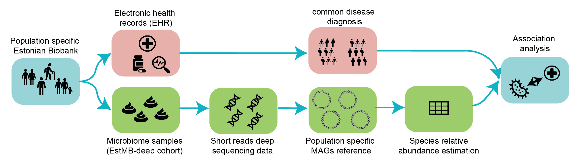
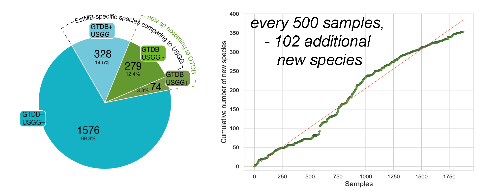
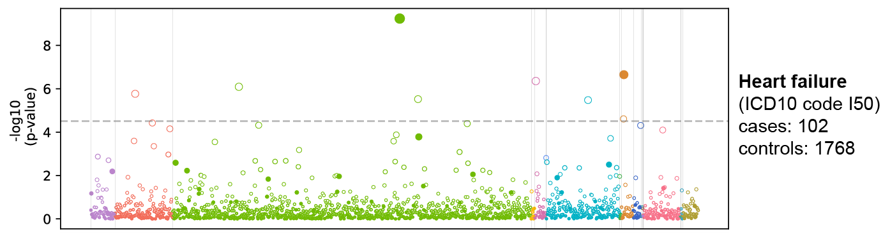

The folder contains the source code for the analyzes for the article:
<h2>Metagenome-assembled genomes of Estonian Microbiome cohort reveal novel species and their links with prevalent diseases</h2>

preprint available here:
https://www.biorxiv.org/content/10.1101/2024.07.06.602324v1

<h4>Short article description:</h4>

Deep metagenomic data from population studies enables genome recovery and construction of population-specific references, including new species and uncovering microbial diversity that global references might miss. We constructed an Estonian population-specific reference of metagenome-assembled genomes (MAGs) from 1,878 stool samples of the EstMB-deep cohort and perform association analysis with common deseases. 

We assembled 84,762 MAGs, representing 2,257 species, including 353 potentially novel species (15.6%). Additionally, 607 species (26.9%) were not present in the global Unified Human Gastrointestinal Genome (UHGG) reference database and may therefore be population-specific. 

We further demonstrated the value of de novo assembly of bacterial genomes by analysing associations with 33 prevalent diseases and detected 44 significant associations for 15 diseases, including with 10 potentially new species and 5 species absent from UHGG. 

The correlations, especially with new species, demonstrate that de novo bacterial genome assembly from population cohorts can provide significant novel insights linking the microbiome with prevalent diseases and uncovering population-specific differences.